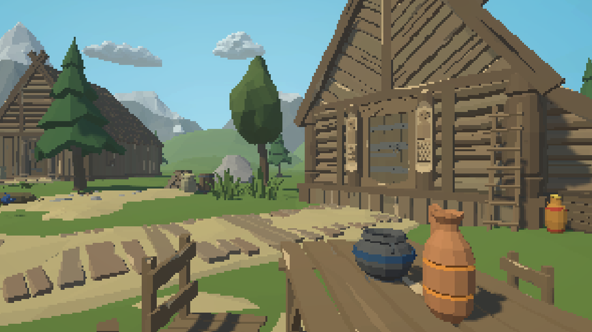
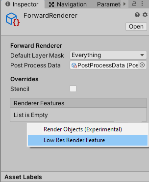
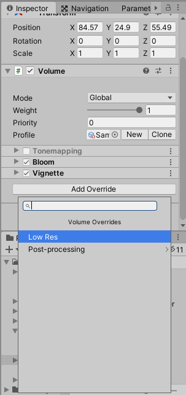
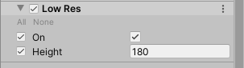

# LowRes
Low resolution effect for Unity URP 

Add LowRes RendererFeature to your forward renderer

Add LowRes effect in post processing volume

Height - screen height in pixels, width depends on aspect ratio

